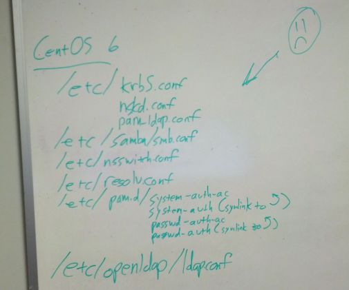

We're back with a new year and I thought what better way to start the new year here at the Church of Foxx than to tackle a hard subject for many system administrators, LDAP authentication on Linux served by a Windows (Active Directory) host.  Well, in a single picture, I'd say it's something a bit like this:

LDAP makes a sad admin

A longer way to put it is *this is two thousand fucking fourteen, what the Hell is all this bullshit?*  I love Linux very much and am fully on-board with its little quirks here and there in the name of a grand, unified operating system that runs on everything, everywhere.  I've been using Linux since the mid nineties without too much trouble.  Almost every machine in my house now runs Linux or a variant of it (only one or two don't).  I've been a Solaris Admin, a Linux Admin, have contributed to community projects, and even instructed complete newbies how all this crazy crap works.

And LDAP on Linux makes me a sad admin.

I'll be making an entry soon on the Wiki of Foxx that goes into specifics as best as I can make them out but like the picture says in order to get LDAP authentication working against Active Directory you've got to modify no less than __ELEVEN__ separate files.  What I'm trying to figure out is how come in this day and age we don't have a single file under, say, */etc/system/ldap.conf*, or similar and __maybe__ a switch in the */etc/pam.conf* with the settings and call it a day?  It's not like it'd be hard.

Anyway, you have to make changes to the following files:

* /etc/krb5.conf
* /etc/nslcd.conf
* /etc/pam_ldap.conf
* /etc/samba/smb.conf
* /etc/nsswitch.conf
* /etc/resolv.conf
* /etc/pam.d/system-auth-ac
* /etc/pam.d/system-auth (symlink to /etc/pam.d/system-auth-ac)
* /etc/pam.d/passwd-auth-ac
* /etc/pam.d/passwd-auth (symlink to /etc/pam.d/passwd-auth-ac)
* /etc/openldap/ldap.conf
I'll go into more detail on the Wiki but mercifully most of those files are fairly self-explanatory.  Make sure you've got a user who can log into Active Directory as well as its password, then fill out the little subsections as the man pages and commented sections suggest (except of course for PAM, those are some arcane voodoo formatted files).  My issue is that just finding out WHICH files to modify as well as the pure volume of them is more complex than even an Apache HTTPD configuration (and that's saying something).  On the positive side other system files like /etc/sudoers actually respect Active Directory groups so the end result is very well integrated into a Linux ecosystem.

Best of luck, intrepid admins embarking on this quest, you'll need it.  It's doable, and when you get it set up it's definitely very nice but don't be surprised if you have to hit your search engine a few times before it's over.  I'll update the wiki as soon as I can.
