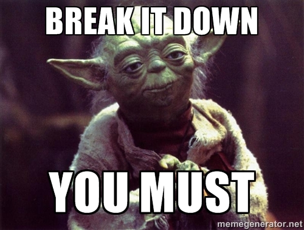
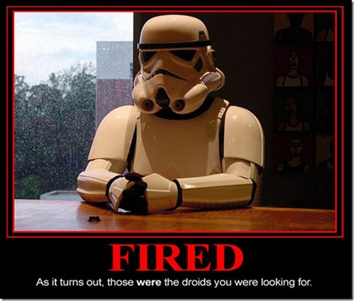
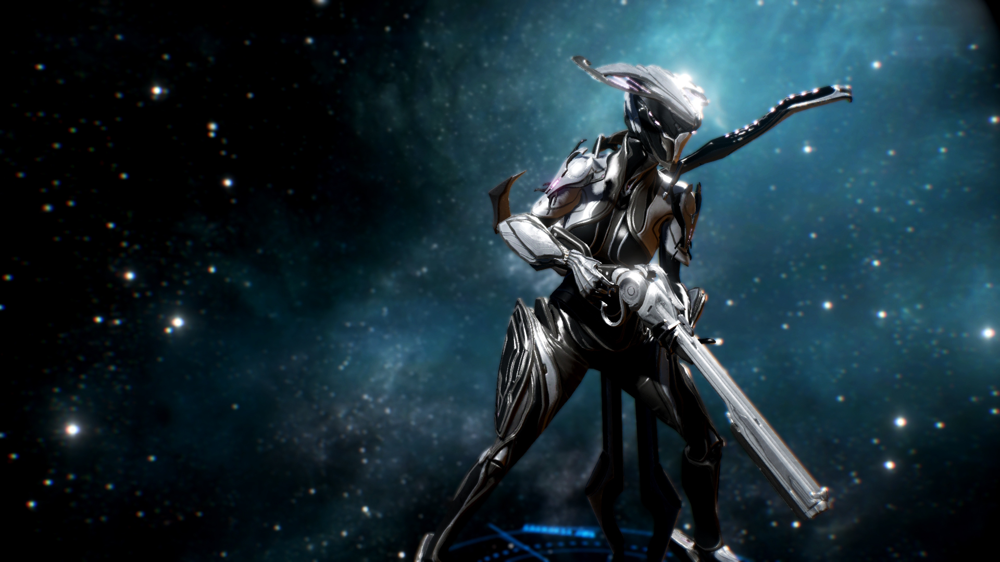

I've quit playing Destiny.

Unlike many people posting on the rage-o-sphere that is the popular Internet I didn't throw down my controller in a huff, flip off the screen, and take my righteous indignation to Reddit, Bungie's forums, or whatever popular outlet of your choice.  I simply stopped playing and after about a week realized I wasn't going to pick it up again anytime soon, barring a friend wanting to play a mission together (I'm a sucker for playing games with friends).   Considering how much time I've spent in Destiny I was a little surprised to suddenly find myself not wanting to play it anymore.  To that end, I thought I'd post a few thoughts and musings on Destiny, what I thought was great about it, but also what eventually made me realize that Destiny was never going to be able to fix...and what other games already have.

## Story / Setting

Surprisingly Destiny's story is not bad at all.  No, I'm not talking about the horrifically voice-acted and poorly scripted dialogue or the numerous plot events bearing examination that never will be as those pretty firmly fall within the realm of "plot" or the literal "stuff that happens." By "story" I mean the WHY of things happening, the undercurrent of motivations, settings, feelings, and other things that you as a player / reader / viewer actually connect with.  Games, being an interactive medium, actually have some more subtle (and not so subtle) elements of story as opposed to books and film so let's break them down a bit.

* Volume of opposition
* Color choice / shading for environments and opposition
* Weapon design
* Scripted events
* Level design

These things combine to give you the "feel" of the game, the story.  In this regard, Destiny actually succeeds in many ways that I don't think people give Bungie enough credit for.  There are numerous instances where a great scripted event occurs in Destiny that makes it blindingly obvious as to what's going on.  Turning the corner in a complex to reveal a long, drawbridge-like entrance, complete with a gate at the end, and suddenly a dozen beefy, angry-looking guards jump onto the bridge in formation tells you pretty obviously that you're storming a castle, these are the guards, and there's likely something epic inside.  Having dozens and dozens of enemies that you can mow down makes you FEEL every bit as powerful as the numbers say you should be.  Your weaponry is pretty familiar in design, it's all stuff similar to what we use today, just stylized but your enemies use things like lazer rifles and such.  This makes you feel, given its futurist, sci-fi setting, like your character is part of a scrappy resistance, using weaponry from bygone eras.  That's good, and it's a great feeling to be "old but still kicking ass." 

So all that said what's bad about the story?  Well, simply put, there's not enough exploration through the plot.  You end up with a lot of questions, like how come you were apparently dead for years and then suddenly brought back with little-to-no brain damage?  As nicely designed as the levels are, you end up playing the same ones over, and over, and over.  There's not exactly a wealth of environments to choose from so it really doesn't take long to burn through all the scenarios, making it feel shorter than before.

## Controls

The controls are literally the most important part of a game.  They are how you affect the world, how you play, and how you translate your will into the confines of the game at hand (ha).  Destiny's controls are absolutely superb but also reveal much about why I stopped playing it.  In short, Destiny, from a control perspective, is Halo.  This isn't much of a surprise given that Bungie made Halo and set a dual-stick standard but what's odd about it in hindsight is that it is very nearly EXACTLY Halo.

Now I love Halo (well, up through Reach anyway).  It's not for everybody, it's a little slower, and there's some design choices that aren't going to sit well with everyone, but I enjoyed it quite a bit.  However, Destiny is very distinctly supposed to be a *departure from Halo*, a "new" thing that while it may have many similarities should still stand on its own.  Destiny instead moves at the same speed as Halo, a similar framerate, but most importantly nearly identical controls.  While it's comfortable it's telling me that I'm actually expected to be playing Halo, something I've already played to death.  While this makes it comfortable I find it difficult to break out and expect "new" things in Destiny.  Other games that have similar control schemes still usually try to mix up the perspective, framerate, setting, and general style of play in order to differentiate.  When they don't they tend to remind you more of "that game you already played" and do not stay fun long.

I feel like Bungie is telling me they want me to be comfortable but not ask for them to push my expectations.  If that's the idea then message received, but I was definitely hoping Destiny would challenge some old Bungie standby designs.  Considering this is the company that pretty much established this control scheme with the original Halo, challenging the conventions of the time, I suppose I was expecting something a little different again.

## Group Dynamics / Social

Let's start with something I like:  Destiny is a small fireteam game.  I've played big detachment games (like Battlefield, WoW, and other games with tons of people) but secretly I love small, focused gameplay on small, highly adaptable teams.  Commandos, if you will.  

The fact that Destiny focuses on two and three person teams for me is a godsend and it feels GREAT when blasting through a mission or two with one or two friends.  Mission accomplished, great job, Bungie, thank you.

With that out of the way, now how in the hell am I supposed to socialize with people in your game?  There's a reason why nearly every MMO in history uses text chat as a fallback.  Text, like in this article, is relatively quick, easy, and most importantly allows introverts AND extroverts to quickly and casually communicate.  Voice communication relies on a level of trust, hence why the biggest users of voice communication in MMOs, shooters, and other team games are, not surprisingly, on a team of people they already know.  If you need a quick example of why open, free-for-all voice comm goes right into the toilet just fire up your favorite high profile shooter, don't mute anyone, and come back to me in a week.  In short, there's a reason why Bungie themselves added a super-quick, super-effective way to mute people in Halo 2 that has been emulated over and over again in nearly every single shooter since.

So if Destiny doesn't have any text chat, and there's no incentive for free-for-all voice chat, how do I hang out with and freely communicate with other users to build a community of people I like to communicate and play with?  You know, something like the average town or town chat channel in any other MMO?  Well...you don't.  The closest analogue is The Tower in Destiny but there's no way (currently) to quickly and easily engage with other people beyond spamming the dance animation command and hoping your target A) is someone you wanna talk to, B) is someone you wanna play with, and C) is going to dig through the labyrinthine menu system for your console of choice to invite to a fireteam.

To be completely and totally fair, you COULD go to somewhere like Reddit to look up similar people but that's precisely the problem:  it forces me to go OUT of your game.  The more time I spend outside of your game, the more I realize I have stuff OTHER than your game to do.  Sending your users outside of your game, except in certain particular extremely rare circumstances (some adventure/puzzle games, games that are widely open to interpretation and story-sharing) you NEVER want the user to log out of your game.  Regardless of whether you like him or not, Cliff Bleszinski is absolutely right ([https://twitter.com/therealcliffyb/status/347497117864054784](https://twitter.com/therealcliffyb/status/347497117864054784)):  ""Do whatever it takes to keep that disc in that tray" is the mantra of developers in a disc based world." By extension, keeping me seated in front of your game and NOT getting up to go and do other things is something you want to encourage, not discourage.

## Beyond Destiny

If you need a TL;DR, play Warframe.  It's basically Destiny++, even visually:

So if I'm not playing Destiny what am I playing?  Warframe oddly enough.  Warframe's an interesting little title from Digital Extremes that they've been wanting to make since the original XBox.  The players take on the roles of space ninjas called Tenno, wield all sorts of weaponry from pistols to shotguns to rifles and other heavy equipment, go on a variety of small team-based cooperative missions all over the solar system battling groups of futuristic bad guys with nifty looking ships.  Sound familiar?

Where it deviates is that it has an entire melee combat system, wall-running, significantly more freedom of movement, does NOT require a Playstation Plus membership if playing on PS4, puts you in the same pool of players as PC and XBox One, has TONS more missions, several large content updates already, free-to-play, LOTS of different classes, a full crafting system, both text and voice chat, PvP and PvE, and much greater variety in missions.  It literally is everything Destiny does and then some, for free, on multiple platforms, together.  It's not 100% perfect, but I realized that everything that had been annoying me in Destiny is already solved in Warframe.  If you haven't tried it and Destiny is annoying you I'd definitely try out Warframe.  Even if you don't like Warframe, there's new impressive, ground-breaking shooters coming out all the time now (I'm a big fan of Toxikk, personally), there's no reason to waste your time on one you're not enjoying.
