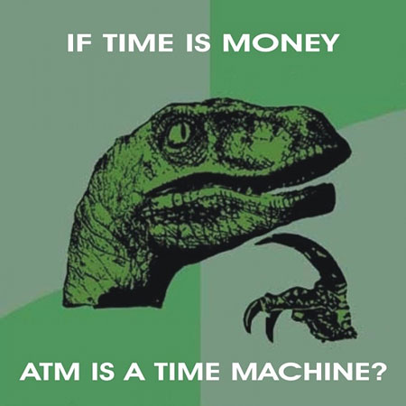

Heroes of the Storm is great, and you should play it.  Yes, you, and I'm well aware of how odd it is for me of all people to be recommending a MOBA-like game.  Why?  Well, let's have a look.

## Gameplay

At its heart Heroes of the Storm (HOTS) is a MOBA game.  Now Blizzard is trying to distance themselves from the term and I can definitely see why but that's how most people are going to see it.  Its core gameplay mechanic is in playing through a third person omniscient view and controlling a single hero on a team (usually five) with a set of abilities (typically about four or so).  Your goal of the game is, like the others, to destroy some tower-defense like towers held by the opposition under cover of automatically-spawned minions, leading the charge deep into the enemy territory to destroy their base.

If this sounds kinda like real-time strategy to you and you haven't played a MOBA game before you're not far off.  It's effectively trying to distill down most of the stuff you do in a more traditional RTS down to some simpler elements and, generally, it can work really well.  You're still effectively doing the same kinds of things, having your power unit (your hero) leading your lesser using (automatically spawned minions) against the enemy front (their towers, minions, and heroes) and using your tactical abilities combined with movement to take the fight to them whilst balancing pressure, defense, and upgrading.

## What's Different?

It's pretty hard to talk about the gameplay though without explaining why it's different.  While MOBA games like League of Legends and DOTA 2 are quite popular, they have (from my point of view) some serious issues that just aren't getting addressed either well or at all.  HOTS is doing its best to challenge those so let's go ahead and drop them here:

* game length
* upgrade complexity
* teamwork

All of these things are, in my opinion, dealt with expertly in HOTS.

## Game Length

So the first thing that jumps out at you is that unlike League of Legends and DOTA 2 the average game length in HOTS is somewhere around 15 minutes, down from 45 minutes to over an hour.  This, alone, is awesome.  Some people really like games to take a long time but especially with a game like this it's all too easy to get paired with people who have no clue how to play against an unstoppable juggernaut of an enemy team.  When that happens you might as well just say goodbye to an hour of your life because there's very little you can do about it.

HOTS on the other hand keeps things short and simple.  It leads to relatively quick, furious battles with lots of action in a very short span of time.  As a result if you have a good time it's immediate and if you have a bad time it's over quick enough that you can try again immediately.  This is also great for people who make only have an hour to play and want to do at least one, but possibly two or even three games.  I personally like this kind of respect for people's time as while __I__ can afford to spend a lot of time gaming not everyone can.  This way they widen the pool of people you can play with whilst simultaneously taking care of issues like players dropping out of a match (there's not a lot of incentive to, given how fast they go).

## Upgrade Complexity

Oh boy, upgrades.  In League of Legends and DOTA 2 you generally get upgraded by earning money through defeating enemies.  You then go and turn this gold in back at the base to buy items that can be equipped to power up your character.  This would be great if there wasn't a literal ton and a half of things to choose from.  Naturally you're under pressure to choose correctly with no idea what to do, so you do what anyone does:  you look up a build online.  It's hard to keep the build straight in your head between characters though so it's pretty common to have the cycle of things you're supposed to go through handy either on a sheet or another monitor.  Blizzard said screw that, and came up with something much better.

In HOTS there is no store.  None.  Zero.  Instead every few levels you get to choose a perk (kinda like in World of Warcraft) from two to four available at each level.  You can do this at any time as well, even in battle.  What this does is give you a chance to adjust your abilities to suit the game at hand as opposed to mechanically running through a complex build that's not really possible for most people to adjust on the fly.  Getting your butt kicked by ranged heroes?  Pick the perk that lets you close the distance faster.  Beating up on minions more than heroes?  Pick the perk that lets you do extra damage to them.  This system is not only simple to use but still provides great tactical complexity and allows you to make MORE decisions during the game, making you feel less like a data entry clerk.

## Teamwork

This is the big one.  In both League of Legends and DOTA 2 you're supposed to work on a team and sure, some high level players can crank out something awesome, but most of us mere mortals are going to be playing with other mere mortals and setting up complex strategy and communication in a single game where you're not likely to see these people again is nearly impossible.  Anyone who's played a good amount of Capture the Flag in any shooter can definitely attest to this.

HOTS provides a few tweaks to make your life with your fellow teammates a hell of a lot better.  The first is a shared experience pool.  This means that when you kill a hero, your whole team gets stronger.  As a result if you get your butt kicked, likely your other teammates are not and there won't be a very large disparity between your team's level and your enemy's.  This also means that players are discouraged from trying to be a "one man team" and do everything on their own since you're all going to be the same level anyway.

They also have multiple maps (thank God, I personally HATE seeing the same map over and over again) and each one has a unique gameplay hook as well that requires use of the team, such as collecting skulls to summon a special bad guy, or collecting spawned control points to "curse" your enemy's towers and heroes.  These are fun, simple to understand, and encourage teamwork.  On top of that they're a GREAT way to come back from the brink of defeat if the enemy team is really steamrolling through you, leading to a large amount of pitched battles back and forth, victory seemingly always within grasp.

## The Storm Calls

So should you play Heroes of the Storm?  Honestly, especially given that it's free to play, has weekly free hero rotations, and all of the above you absolutely should try it out.  This is probably the most fun I've had in a multiplayer game in awhile and that's quite a surprise for me since I normally hate these kinds of games.  Plus, if you're a Blizzard fan, all of your favorite characters and more from every game they've made are either here already or going in shortly.  You always wanted to kick ass as Thrall?  Wanted to burn and pillage as the mighty Diablo?  Shut down enemies from afar with futuristic tech as Nova?  This game already has all of those and many, many more.

So yeah, have some fun, make some new friends, and hopefully I'll see you in the Storm.
