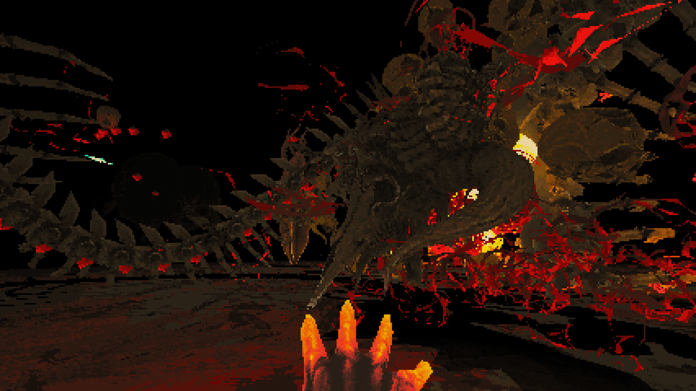

I have ADHD. There are a lot of jokes and pop culture references to it but what it means is that I struggle with, among other things, attention. It cannot be shaken off, it’s not able to be forced through, and while there are techniques and treatments to help control it, there is no cure. It can be difficult to describe to someone who doesn’t have it what it’s like to experience it, how it changes normal interactions, how it makes me feel, and how it challenges me every day.

So how can you let someone experience what ADHD is like? One of the best tools available for solving this particular problem is a video game. With the right game and the right “story” told by its gameplay and setup, you can give someone a unique experience. [Devil Daggers](http://devildaggers.com/) is a game created by [@sorathdev](https://twitter.com/sorathdev?lang=en) and to see its videos or read about it, it’s a dark, bleak game where you last as long as you can against horrific enemies. Actually playing it, on the other hand, reveals a very different purpose, at least for me. To me,  Devil Daggers is a game about what it’s like to deal with ADHD.

It’s hard to really talk about a game though without seeing it. This is me playing Devil Daggers:

_Note:_ you may need to click the image if it doesn't automatically play.

What you’re seeing is my very best run on Devil Daggers, as of this writing. That’s not to say I’m amazing as I am _far_ from it. What you _are_ seeing, however, is what’s in my head. This is what I see when I try to clear my mind. This is what it’s like for me every day. We’ll be exploring what I mean by that.

# Setup

* Single player.
* Style of a 90’s shooter.
* One movement style.
* One level.
* One weapon.
* One game mode.
* One life.
* Infinite enemies.

The setup is simple. A platform with a single light source surrounded by darkness. Very soon creatures come in from the dark and you have to use a stream of daggers from your hand to clear them out. One touch means death and starting over. The goal is to survive as long as possible. That’s all there is.

This isn’t actually a particularly difficult style of game to play. If the player has any experience with 90’s arena shooters or similar titles that feature movement and shooting simultaneously then the player will feel at home immediately. Circle strafe, hold down the left mouse button, jump for speed increases, etc. It’s all familiar and feels, “right.” However, many players find difficulty playing for even 30 seconds to begin with. More advanced and seasoned players can go for 90 seconds or longer. With practice, many players are able to play for hundreds of seconds with the top player going for well in excess of one thousand seconds. For me, I can only do the 225s above. But why? I’ve been playing games like this for over twenty years and have no problem with this style of play. To find out why, we’ll need to learn a little more about ADHD.

# What is ADHD?

The DSM-V defines Attention Deficit Hyperactivity Disorder (ADHD) by the following criteria:
* A persistent pattern of inattention and/or hyperactivity-impulsivity that interferes with functioning or development.
* Fails to give close attention details
* Difficulty sustaining attention in tasks or play activities
* Forgetfulness
* Does not follow through on instructions
* Difficulty organizing tasks and activities
* Talks excessively
* Interrupts or intrudes on others
* Fidgets

You may be familiar with some of these. I exhibit some of these myself, including talking excessively and fidgeting as well as forgetfulness and difficulty sustaining attention. Everyone is a little different but it should give you a good idea of what is involved.

# Authorial Intent

What I’m writing about involves interpreting the work while generally disregarding the dev’s intentions or, “authorial intent.” It’s a massive topic on its own well beyond the scope of this discussion, but a simple breakdown of schools of criticism with regards to authorial intent is as such:

* Anti-authorial intent
  * New Criticism
  * Psychoanalytic criticism
  * Cambridge School Contextualism
  * Post-structuralism
* Pro-authorial intent
  * Marxist criticism
  * Weak intentionalism
  * Even these are “it depends” territory
* Other
  * Reader response

Most forms of criticism do not consider the author’s intent since it’s not really feasible for us to know the mind of the author. Thus, we can can only evaluate their work. Even the more pro-authorial intent styles are generally along the lines of that intent being an interesting footnote or aside but not really critical to understanding the work.

# Story

So what is Devil Daggers about then? To understand that we examine the following:

* Game mechanics are simple
* Play options are simple
* The challenge is in focused play
* Game is structured to require absolute focus
* When attention slips the player tends to die VERY quickly

As mentioned above, this isn’t a particularly difficult style of game to come to grips with and is clearly intentional. It strips away all excess options, game modes, and even movement styles to leave only the bare minimum required to build a challenging shooter. The result is a focused game with focused controls that benefits from and requires your focus.

So what causes failure in this game? Simply put, a lack of focus. When I’m playing the game an observer can actually see when my mind begins to slip as my performance immediately plummets. This loss of focus can be from anything, a passing thought, a sound outside of the game, worrying about the heat death of the universe, anything. This is exactly what a sufferer of ADHD is suffering from, an immediate loss of focus and trying frantically to regain it.

Hyperfocus, a common thing with ADHD, is also an enemy. To maintain proper situational awareness the player needs to be mindful of the sounds, sights, target priority, and velocity of multiple moving parts. The tendency to hyperfocus on one aspect can cause failure due to ignoring the other aspects. One needs to be focused but not hyperfocus for long-term play.

With all of these in mind, the story is a person with ADHD trying to clear his or her mind, to gain peace. It can only be done for extremely short periods of time though, and the onslaught is never ending.

# Symbology

## Skulls

All the enemies take the form of skulls. This is because while intruding thoughts and distractions can take many forms ultimately they are creations of your own mind, inside your own head. Essentially, the enemies you face are made of you. Fighting against them is fighting against your own mind, just like with ADHD.

## Platform

The platform is bare and simple with only a single light in the center. This is your consciousness, your active mind. When trying to meditate many ADHD sufferers will complain of “rushing thoughts,” things intruding on your careful space in your mind. This is the exact behavior of Devil Daggers and you are trying to clear this space so you can freely roam it without fear. Straying too far from it drops you off into the dark, your mind passing too far beyond the desired meditative state.

## Sound

Sound is an extremely important but subtle feature. On those rare occasions where you can clear the entire platform a soft, soothing, aetherial sound is able to be heard. This is the peace and meditative state where the mind is empty. Enemies also not only make distinct sounds but can cause you to spend attention and focus on trying to ascertain distance, speed, type, and more. Eventually,  when unlocking full power, your hand even gains a sound, giving you something to “hone in” on mentally. Unfortunately, like everything else, that’s another resource that saps your focus, seemingly innocuously and if you hyperfocus on it you’ll get distracted and lose, just like with ADHD.

## Score

The most important feature in this game is the score. Ultimately, Devil Daggers is a survival game in that it grades you on how long you can stay alive. It’s not unusual for many players to survive only 30 to 60 seconds but as your skill in the game increases you can clear enemies faster, learn the spawn patterns, and stay alive longer and longer. The problem is that for an ADHD sufferer while it’s not complicated, it requires sustained focus. If your thoughts stray, if something distracts you, if anything at all is not completely and totally locked into what you’re doing then the ADHD player will become disoriented, miss shots and dodges, and die.

This means that the time spent alive in the game is not a measure of skill but of focus. The score is a measure of how long you can remain completely focused on a single objective to the exclusion of all else, to focus but not hyperfocus, to pay attention.

# Conclusion

Describing what sort of experience ADHD is can be surprisingly difficult. It’s a condition that requires mental strategies, practice, prioritization, and tireless devotion to wrestle with. Its effects can be seen easily by others but the firsthand experience cannot. Through this game you can learn what it’s like to have ADHD, to see how people with it play and strategize, and experience the triumphs and failures along with them.

When you see my replay, you’re not watching me just play a game. You’re watching my mind, what it’s like for me to clear my head, what it’s like for me to stay trained on a task to the exclusion of all else. My best time is 225s. That’s it. That’s all I’ve got. And yet, I will keep pushing to try and gain just one more second as long as I possibly can.

