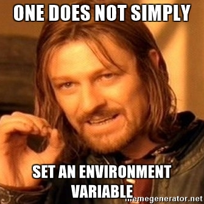
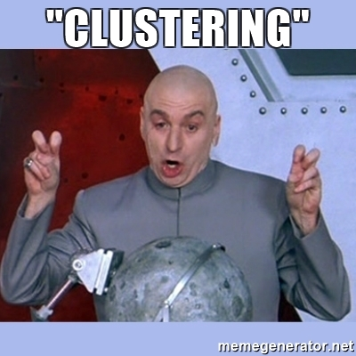
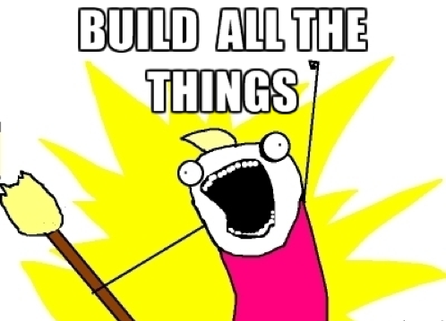

I’ve been using [Docker](https://www.docker.com/) quite a bit over the past year and, as with any new technology, have learned much of its use and deployment. Like any learning experience, though, there were numerous failures. Some were my own fault, some were the fault of Docker, but most I’ve discovered were caused by not knowing when one _should_ use Docker. I hope the following lessons will help you the next time you have to deal with Docker or other lightweight container solutions.

# Build a [Minecraft](https://minecraft.net/en-us/) Server

The start of any container project needs to be, “_SHOULD_ we containerize this application?” There are many ways go about answering that question, but the fastest way I’ve found is to build a [Minecraft](https://minecraft.net/en-us/) server container. [Minecraft](https://minecraft.net/en-us/) is a popular creative game that runs on any platform that runs [Java](https://www.java.com/en/). It also features a persistent game world that regularly saves to storage, can be restarted fairly easily, has a customizable and long-lived configuration, and listens on a port for connections. Due to these properties, it’s an ideal, functional example of the many challenges faced when building a container and the sorts of questions you’ll need to answer before you begin on other projects.

## Storage

When a container is stopped, all changes are reverted. This is a Bad Thing (tm) for a game server since it means all the hard work put in by the players will be destroyed. Naturally, this is where _Volumes_ come in. You can note the area in the container where the game world is going to be stored as a Volume and then stopping or starting the container will no longer destroy the world. Great, right?

Until the container is destroyed.

There are many cases where you’ll destroy a container but we’ll get to those in a bit. To properly divorce all storage concerns you’ll need to either have an external filesystem mount and override the Volume with it (such as `-v /mnt/super/serious/storage:/path/to/world`) every time it's started *or* create a whole separate container solely for storing the volume, called a volume container. More on that in a min.

## Upgrades

This is great for getting one version of the game server up, but what about when it’s upgraded? You can’t upgrade a deployed container in place unless you’re going to manually go in and mess with it. Instead you need to make a new container with the new version of the server. When you’re done, you’ll shut down the old container and start up the new container. This, of course, is one of the many ways that the old, current container can be destroyed since you’ll no longer need it.

That storage volume? Well, if you were relying on the previous container then that means, with an upgrade, you’ll now have either two containers rolling for the one server or you destroy the old container and lose the data. If you chose to use a volume container, you still have two containers for your server, one of which may be damaged if multiple other containers try to use it concurrently. If you were using a separate storage mount (such as an NFS mount), this is less of a concern but all future containers need to be set up with the same override. It’s not a *problem* but, like all lessons here, it’s something to note.

## Configuration

So, how about the persistent configuration? There are many ways to tackle this; the first and most natural is to write a configuration for the server and have it copied into the container at build-time. This means you’ll have to hard-code those values, some of which you may not be comfortable with other people knowing (like the list of ops, certain tweaks, etc). This is especially true with a public repo (you’d want to share your work, wouldn’t you?).

To make a more dynamic configuration, you may wish to use environment variables which are quite popular in the Docker world. This means that whenever launching the container, like the storage volume override, you need to make sure you always supply that environment variable and code a startup script for the game server that takes those into account. The best way I’ve found to do this is to supply a list of environment variables in the Dockerfile, have those fed to a Bash script with defaults for those variables, then source that file inside of the container at build time with an installation script, then remove the file.

You might be noticing a pattern here in that keeping track of how to launch the container is starting to be a problem unto itself (one you may even wish to script since that’s pretty natural but then you have to keep track of _that_ script...). The concept of containers is that they’re easily restarted, redeployed, and rebuilt but actually accomplishing those requires some planning. I’ve found the best approach is to supply reasonable defaults that can be overridden at launch. It’s a lot of extra work but keeps things understandable in six months or more when trying to figure out what you wrote and how it works.

## Distribution

Okay, so you’ve got your container built, you’ve got defaults for the game server’s configuration that make sense, a handle on how you’re going to deal with storage so you can upgrade this thing in the future, and you’re ready to share it with the world on [Docker Hub](https://hub.docker.com). You’re done. You’re ready. You’ve arrived.

But about that…

You can’t legally redistribute your container. Why? Because that would be redistributing Mojang and Microsoft’s intellectual property since they own distribution rights for Minecraft which includes the server code. Just because it can be packaged doesn’t mean that you have the right to actually distribute that package, only the instructions on how to do so.

So what do you do about this? Well, as of the time of this writing you can still create a Docker Hub repo and put up your Dockerfile, just not the container. You can also distribute your code through other means, just not the container. You can even write blog posts about how you built it, just not supply downloads to the container.

Legal considerations are just as important as any other technical consideration, they just use different tools to solve them. Like the other issues dealt with, these, too, should be kept in mind when deciding whether or not something _should_ be containerized.

## Clustering

Finally, we have clustering concerns. Oh clusters, is there anything you cannot make significantly more complicated?

You might be interested in a lot of uptime for your container or just enjoy messing around with clustering technology. Both Swarm and Kubernetes are popular technologies for clustering containers which are well beyond the scope of this post but, suffice it to say, you’ll likely be running on one of them if you’re interested in this sort of thing.

Volume Containers, generally, don’t work in clusters very well. This is because, at least as of the time of this writing, they will not get moved from node to node with your server container which means storage breaks. Replicas of containers are not real-time synchronized processes but instead multiple started containers that the cluster diverts traffic to in the event of failure.  This means that unless you’re using external storage volume overrides when one dies, your world data dies, too. You also have to make sure the service doesn’t try to start multiple containers pointing at the same storage since concurrent writes may cause issues (Minecraft is expecting one directory, one world, and one owner at a time).

# Learn How to Clean Up

Up until now we’ve only examined how to actually build, configure, deploy, and distribute our Minecraft server container, but what about the development process and deployment in the long term? Is that all there is to it? Like with all things with containers, no, of course not.

Docker, generally, doesn’t really clean up after itself very well. Stopped containers are not automatically destroyed, intermediate containers created during the build process continue to persist, and when starting containers with the same name, it causes conflicts with existing, stopped containers with the same name. Storage volumes also are not automatically destroyed even when their owner containers are destroyed, so those *also* need to be cleaned up.

I have some methods I jotted down for doing Docker maintenance myself [here](https://github.com/frozenfoxx/frozenfoxx.github.io/wiki/Docker#procedures) and run them regularly whenever I’m deploying or building something in Docker. You don’t have to do the same obviously, but you’ll want to think about how much these issues bother you, how you want to clean up after Docker, and how often it should be done.

# Build Many Examples

The last tip I have is that it helps to build example containers. Lots and lots of example containers. It’s a lot different from unrolling a binary, writing a startup script, and letting it roll. This isn’t really a bad thing but, as it’s more complicated, the only way to get better is with practice. It’s familiar advice but it’s still tried and true.

# Use When Appropriate

Figuring out how to deploy, build, and maintain a Minecraft server ends up with many of the same sorts of questions you’ll have for almost any application being containerized. It’s not always the best option; as you can see, even this seemingly trivial example has a surprising amount of work. If you chose to just use a VM or a bare metal machine lying around, you automatically get persistence of world data, settings, and upgrades for “free” but it’s not as portable. Even if you make it into a portable container, you may have problems with distribution. In the end, Docker and other container technology is not good or bad but just another tool for the toolbox. Having the answers to these questions will help you determine if it’s worth it for a project and make you a more well-rounded developer.

And seriously, we can always use more of those.
