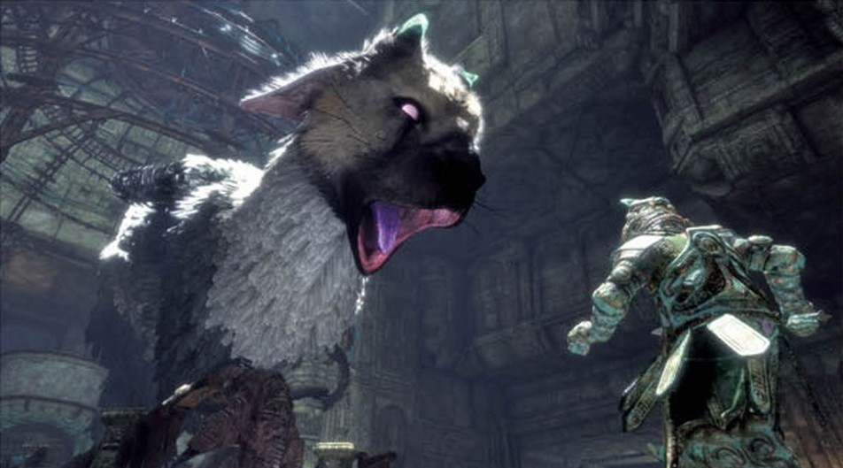

Post Traumatic Stress Disorder, or PTSD, is a serious illness.  It’s estimated by [PTSD United](http://www.ptsdunited.org/) that there’s over [24 million people](http://www.ptsdunited.org/ptsd-statistics-2/) in the USA alone at any given time afflicted by it. There are numerous jokes and pop culture references to it, films, books, and even games that feature it as a subject. It can happen to anyone for a variety of reasons, but they all share one, titular item in common: trauma. Like other trauma, in most cases, it requires treatment and if you’ve never cared for someone with PTSD, it can be very hard to know how to help. For those who have, it’s very difficult to describe the emotional journey you embarked on, what sorts of trials you faced together, and what the successes and failures looked like.

Unfortunately, it’s difficult to fully describe just what helping care for a person with PTSD is like. [The Last Guardian](https://www.playstation.com/en-us/games/the-last-guardian-ps4/) is a game created by [JAPAN Studio](https://www.playstation.com/en-in/footer/about-us/world-wide-studios/sie-japan-studio/) that does a phenomenal job of this. The game tells a fantastic story of a boy and a dragon working together to escape a prison, but through the interactive medium, it also tells a very personal story about what it’s like to care for someone with PTSD.

Before we begin, I figure we should all be familiar with the game. So first, a quick demo of The Last Guardian.

_Note:_ if it doesn’t automatically play you may have to click on the image.

This is a story of a friendship, a deep bond between a dragon and a boy, but most importantly, it’s a story about a journey out of darkness. This post will be exploring that story and how it can help make us better, too.

# Setup

* Single player
* Story/Puzzle game
* You have no means of attack
* You have no means of defense
* You cannot escape on your own
* You have a pet dragon

The setup for this game is initially familiar to anyone who has played this studio’s previous works. It’s a third person puzzle game where you’ll be leading and giving commands to the dragon, Trico. A key part of this gameplay is that, as the boy, you cannot directly control Trico, only point, gesture, comfort, and call. He cannot clear obstacles on his own nor does he know the way out of the city you find yourselves in together. This means that you’ll need to help remove obstacles in Trico’s way and direct him where to go, but if he doesn’t understand your direction or doesn’t want to follow you, another part of the game is figuring out why and helping him out.

As you might have noticed, all of the mechanics of this game are based around the dragon, not the boy. Everything in this game is centered around the dragon, including the symbolism. You do not have a pet dragon, you have a powerful but damaged friend that you need to help. The gameplay is designed to reinforce the severe trauma that Trico has been through, but to understand how your role as both the player and the boy in the story further, we need to first examine more about PTSD.

# What is Post Traumatic Stress Disorder?

The DSM-5 defines Post Traumatic Stress Disorder (PTSD) as a person having the following:
* The person was exposed to: death, threatened death, actual or threatened serious injury, or actual or threatened sexual violence
* The traumatic event is persistently re-experienced
* Avoidance of trauma-related stimuli after the trauma
* Negative thoughts or feelings that began or worsened after the trauma
* Trauma-related arousal and reactivity that began or worsened after the trauma
* Symptoms last for more than 1 month
* Symptoms create distress or functional impairment
* Symptoms are not due to medication, substance use, or other illness.

This is, of course not a complete list, and I am not a licensed professional. For more information on PTSD, check [https://www.ptsd.va.gov/professional/PTSD-overview/dsm5_criteria_ptsd.asp](https://www.ptsd.va.gov/professional/PTSD-overview/dsm5_criteria_ptsd.asp). These are some very quick notes; a full diagnosis of PTSD is complicated and should only be done by a licensed professional.

The sort of exposure to trauma they’re talking about is direct, witnessed, or indirect via close friends/family or employment. By re-experiencing the trauma, they mean intrusive thoughts, nightmares, or flashbacks. Avoidance of trauma-related stimuli refers to the feelings and reminders of the event. The negative thoughts and/or feelings can be very broad, including inability to recall key features, overly negative thoughts, feeling isolated, and so forth. The reactivity and worsening can mean, among other things, irritability, risky behavior, hypervigilance, and difficulty concentrating or sleeping.

A very important symptom from that list with relevance to the game is, “distress or impairment.” PTSD is a long-lasting, crippling condition that someone can’t just “get better” from or “be strong” to get through; it requires treatment or it can devastate a person’s ability to function normally. There are four primary methods of treatment and a mix of those is generally considered best. For this discussion,we’re going to be most concerned with the one called, “prolonged exposure,” therapy. The game really doesn’t dip into the others but hits pretty heavily on this one.

As noted above, this is a really complicated topic whose full scope is beyond this post. If you’re interested in more information, I urge you to check out the VA’s site detailing the therapies, available [here](https://www.ptsd.va.gov/public/treatment/therapy-med/index.asp).

Now that we know a little more about PTSD, we can examine how the game deals with it and the ways the gameplay reinforces treatment and care for a sufferer of PTSD. However, there’s a final note about that analysis to get out of the way that has to deal with authorial intent.

# Authorial Intent

As noted in other posts, what I’m writing about involves interpreting the work while generally disregarding the dev’s intentions or, “authorial intent.” This is a huge topic, one that deserves its own proper exploration and would take far too much time right here. A simple breakdown of the major schools of criticism with regard to authorial intent is:

* Anti-authorial intent
  * New Criticism
  * Psychoanalytic criticism
  * Cambridge School Contextualism
  * Post-structuralism
* Pro-authorial intent
  * Marxist criticism
  * Weak intentionalism
  * Even these are “it depends” territory
* Other
  * Reader response

There’s a lot to discuss in every one of these, but almost all of them do not consider the author’s (or developer’s in this case) intent since it’s not really feasible for us to know the mind of the author, only their work. Even the more pro-authorial intent styles are generally along the lines of the idea that intent is an interesting footnote or aside, but not really critical to understanding the work. With that out of the way, let’s move on.

# Story

So, what is The Last Guardian about then? To understand that, we examine the following:

* Being a caregiver to a person with PTSD (a dragon in this case)
* Console him when he’s enraged
* Guide him when he’s unsure where to go next
* Care for him when he’s had too much pain
* Help him grapple with his source of trauma
* Lead him out of darkness

The overall story is being a caregiver to a person with PTSD. What does this entail? The first thing you’ll have to do is learn to console the dragon when he’s enraged. There are enemies in the game that will try to attack you and your dragon. While Trico, the dragon, is MORE than capable of destroying them, he’ll be completely enraged. It looks like he’s stuck in a flashback to an earlier time, his eyes change to a different color, he sounds and acts differently, and will keep pounding lifeless bodies to dust. Before you can proceed, you need to leap onto him, climb to a spot between his wings and pet him, reassuring him that it’s okay with soft sounds as well. After this, Trico begins to calm down, remembers where he is as he looks back at you, and becomes the gentle giant once more.

You’ll also have to help guide him. Most of the time, your dragon doesn’t really know where you’re going together. Sometimes, he can follow you okay, but ,even then, still looks unsure. You have to help lead him and encourage him how to head forward, but you cannot drag him there or force him and you cannot progress until he decides he’s ready to go. This is very similar to how caring for a PTSD patient has to be done, as they don’t normally know the way forward, you’ll need to help guide them. It’s a lot of trust and the game does an excellent job of showing that.

There’s also helping Trico deal with pain. Earlier, he’s unable to take even single spears hurled at him, recoiling in fear and pain. You have to pull the spears from his body, console him, and feed him when he’s weak. As the game goes on, he can take more and more pain without needing your care as he becomes stronger and more assertive in the new form he’s taking. This is very similar to exposure therapy, where, at first, the patient will not be able to take much but over time, with assistance, will gradually become stronger against the source of the trauma.

Along the same lines, you’ll also have to help Trico grapple with his trauma. There are many instances of this, but one of the most common are these stained glass “evil eye” things you find in addition to some of the ancient machinery. Trico is _TERRIFIED_ of these things, not because they DO anything, but because they’re from his old life, the trauma, and reminds him of when they were used to control him. Smashing these, finding alternate routes, and ways forward despite them is a big part of your job.

The most central theme, though, is helping guide the dragon out of darkness. It’s a consistent identifier used by PTSD patients and other sufferers of mental disorders, to be in darkness, unable to see the light of hope. You have to help lead him out of darkness back towards the light of life and hope. Due to the game’s ending, you even *literally* help him ascend, to quite literally rise above his trauma and reclaim himself. If you fail, he’ll be lost in that pit forever and the game gives you every opportunity to overcome all obstacles to help ensure he never sees that darkened hole ever again.

# Symbolism

## Trico’s Face

The image of the dragon’s face is a powerful one. His eyes give you an indication of where he is mentally by using color and intensity. When they are green and calm, he’s with you and completely engaged, a gentle giant. Alternately, when he’s enraged or in the middle of experiencing his trauma, they turn purple. The intensity of the color reflects the intensity of the emotion he’s experiencing. He also has giant streaks down his face and broken horns which symbolize the horrible trauma you help him overcome. As you help guide him out of the darkness, he gets stronger and, by your actions his horns regrow, he becomes more luminous, and even the quite literal “light in his eyes” returns.

## Evil Eyes

Throughout the game are large, stained glass “evil eyes.” They are literal symbols of trauma for Trico. When you come across these things, Trico gets VERY angry, his eyes change back to the, “war form,” and he flat-out refuses to move past them in the same way that a PTSD sufferer will have difficulty with moving past triggers of that trauma. In the game, you have to either move or destroy these to allow Trico to move forward. With gradually increasing exposure, he’s able to finally get past them, to put away the symbols of trauma.

## Armor

The dragon is initially covered with armor and, deeper in the game, we find there are other instances of the armor as well. The armor on the dragon is a mental cage, a relic of the war machine he was previously a part of and that which hurt him so. With the armor, Trico is a terrifying, alien beast like his former comrades all are. However, once the armor is gone, we can see the truth, that he’s a hurt, gentle giant.

As it’s the only life he’s known, it’s also representative of a comfortable shield against the truth of his situation and his trauma. His healing can only begin after the armor is removed, which is why the very first thing you do is help him remove it.

## Tricopath

You encounter a creature very similar to Trico, but is currently still caged within the armor. This character is commonly referred to as the Tricopath and is symbolic of his former self. As it still has its armor, the Tricopath is still violent, still caged, quite literally, in the old ways of the war machine that your dragon escaped. It’s what he once was in all of its terrible, violent fury.

For some time, Trico is unwilling to attack, wrestle, or otherwise deal with this ghost of his former self. He seems to sense that it’s just like him, but different somehow. It’s only when the this version of his old self tries directly to kill you that he’s willing to attack it, to deal with his former life. With your help, he’s able to overcome it and, in the final credits, we’re able to see both Trico and the Tricopath at peace with each other, Trico having finally resolved and accepted his old life.

## Mirror Shield

The mirror shield is an item the boy is equipped with early on, but it is soon taken away, only to be returned later towards the end of the game. In game terms, it’s a literal key actually used for some puzzles, but much more importantly, as a symbol, it’s Trico’s acceptance of the trauma he experienced. When you use it, the dragon is directed to cause great destruction as a beast of war. However, like when re-experiencing the trauma in combat, his eyes change color, he howls out in pain; it’s not something he enjoys experiencing, and it’s far too early in the beginning of the game for him to use those skills so closely associated with his trauma.

Later in the game, when he’s been exposed enough and is ready for it, the mirror shield is given back to you. It no longer bothers him the same way and so it is returned. Trico has accepted and moved on from his old life, which means you can use its power WITH him, not controlling him. With acceptance, he gains an appreciation for his skills; they don’t have to be solely associated with trauma.

## Sound

The sound design and music are exceptional on their own, but they are also key piece of symbolism. Almost all music is driven by Trico’s actions, not the boy’s. This is important because it helps drive home that this is not _your_ story, it’s _his_ story and you’re simply helping him. The one exception is when being chased by animated suits of armor, but even this can still be tied to the dragon as per the discussion on the armor. All swells, drops, and other impactful sounds are as a result of Trico’s triumphs, failures, and struggles as befits a soundtrack for a main character, which you are not. In fact, the only notable sounds from the boy are when you’re guiding Trico.

## Title

The title itself is also an important symbol. Who is the Last Guardian? It’s you, the boy. The ending tells us that there are more dragons, but that there are no more children like you, the boy is the last. Being a guardian is far more than having strong physical attributes and a formal charge to protect something, it’s far more fluid than that. The boy and, by extension, the player was the last guardian of the dragon’s sanity, his sole source of light by which he could return home.

# Conclusion

PTSD is a terrible condition. It’s pervasive, it’s serious, and it can pull even the strongest people down into a well of darkness. When we experience awful, traumatic events, we often need help from people we trust. They see us at our most vulnerable, they protect us, they guide us out of the darkness. They are our guardians, and, in this game, you can learn how to be one, too.

